# Dead Air · Your Coast, Your Cut

An original coastal pirate-TV experience built around Unlayer React Image Editor. Name your station, catch an animated camera sequence, freeze and edit a frame, go live, handle a caller and a warning at the van, then cut your getaway episode.

[Live experience](https://dead-air-woad.vercel.app/) · [Public source](https://github.com/adityasarade/dead-air-coast)


*One continuous take of the live build: the frozen camera plate in React Image Editor, a coral mark traced across it, the editor's own Save, and that exact image landing in Preview and then on air.*

## For judges: the 60-second route

1. Select **BOOT THE STATION**, then **SKIP INTRO** if you would rather not wait out the uplink.
2. Type any callsign and select **CONNECT TO CAMERA 08**.
3. On the live feed, select **FREEZE & EDIT THIS FRAME**. React Image Editor opens on the full-resolution plate.
4. Make one visible move — Draw a line, add Text, apply a Filter — then use the editor's own **Save** control. An untouched Save is refused.
5. Your exact saved image is now in **PREVIEW**. Select **TAKE LIVE** and it becomes the on-air picture.
6. Answer the caller, then answer the fixer's warning at the van. Select **CUT & GET OUT**, then **KEEP EPISODE CARD** to download a 1600 × 1200 card with your unmodified saved plate inside it.
7. Select **RUN ANOTHER NIGHT** to see a different branch without redoing your ident.

The moment worth watching is step 4 into step 5: the picture you saved in Unlayer is the picture the city sees. Nothing is re-rendered, re-encoded, or substituted between the two.

## The edit propagates — three captures from one run

| 01 The plate, untouched | 02 Marked in React Image Editor | 03 On air, unaltered |
| --- | --- | --- |
| 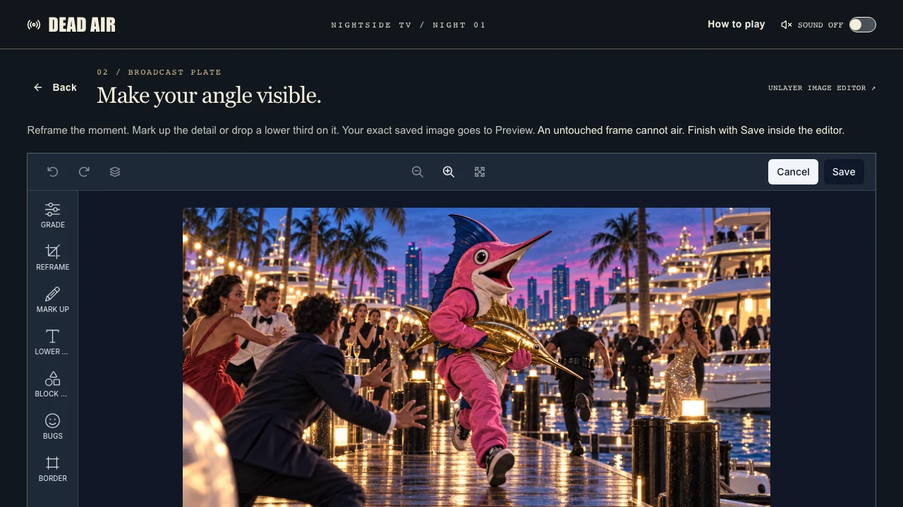 | 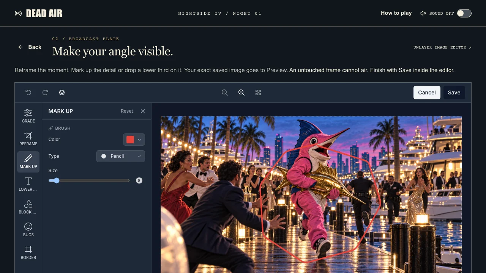 | 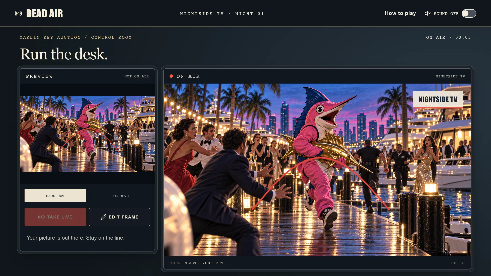 |

These are actual browser captures from the running application, not mockups. The coral stroke in 02 is the stroke in 03.

## GTA VI-inspired — what is borrowed, and what is original

What is borrowed is an idea, not an asset: the tension of a bright coastal crime world where someone is always filming, and where the footage is worth more than the crime. Dead Air answers it by handing you the least glamorous job in that world — running a pirate television van from a parking spot near a marina auction.

Everything visible is original. Marlin Key, NIGHTSIDE and every other callsign, the auction, the pink marlin mascot, the golden fish, the fixer, the captions and the sign-off lines were all written and illustrated for this project. There are no Rockstar screenshots, no trailer footage, no franchise logos, maps, characters, interface styling, audio or leaked material anywhere in this repository. Dead Air is an unofficial, independent contest entry and is not affiliated with or endorsed by Rockstar Games or Take-Two Interactive. See [art provenance](docs/art-provenance.md) and [music licence](docs/music-license.md).

## The loop

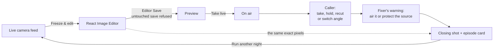

Remove React Image Editor and there is no picture to broadcast: Preview, the on-air monitor, the correction history, the replay and the episode card all render the one `dataUrl` the editor returned.

## Screenshots

| Arrival | Station uplink |
| --- | --- |
| 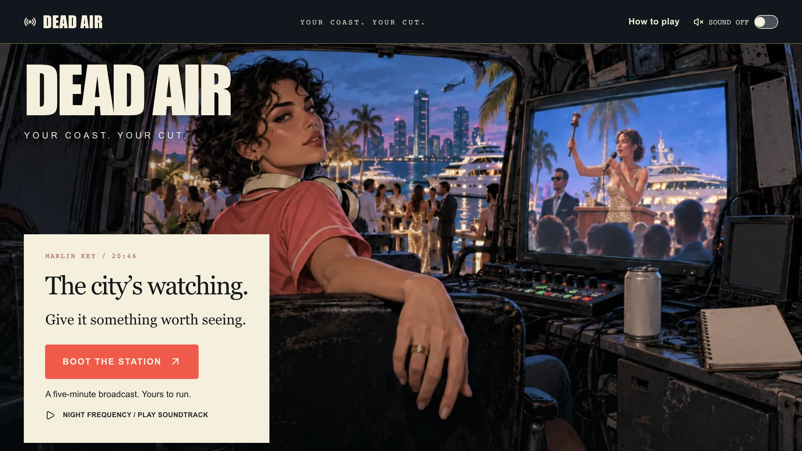 | 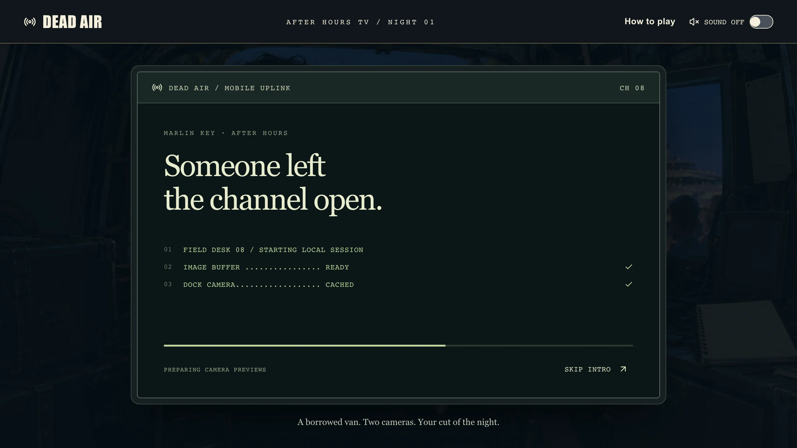 |

| Your callsign | The live feed |
| --- | --- |
| 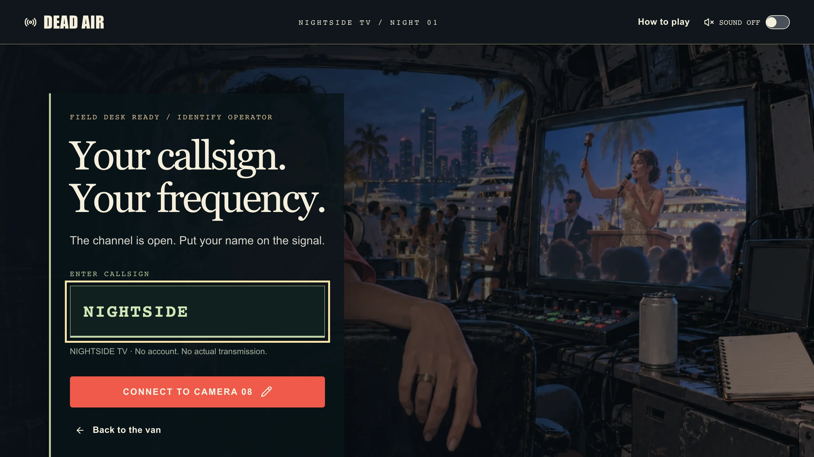 | 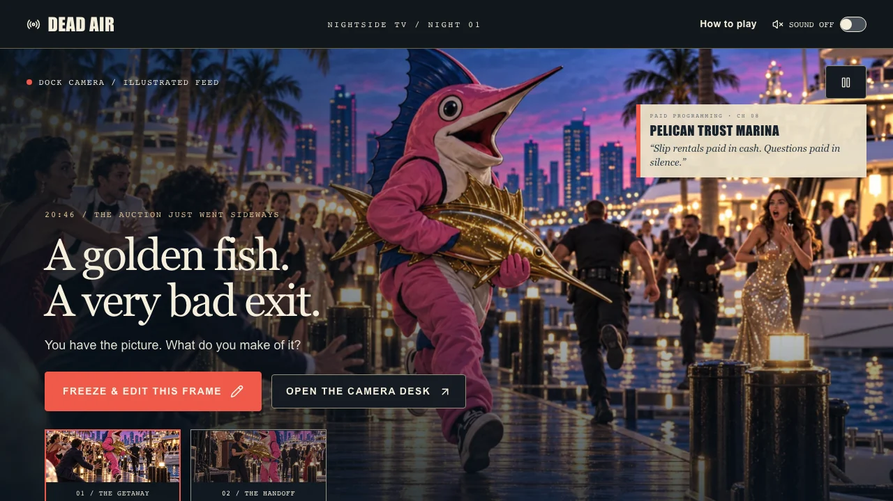 |

| The control room | The caller |
| --- | --- |
| 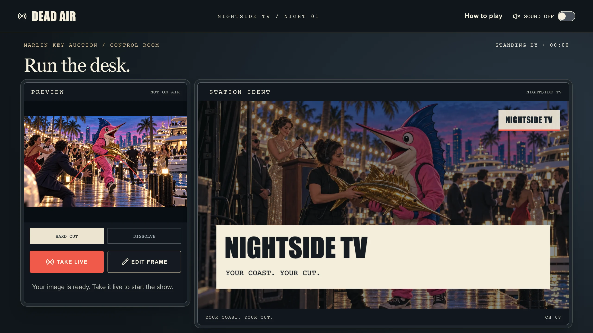 | 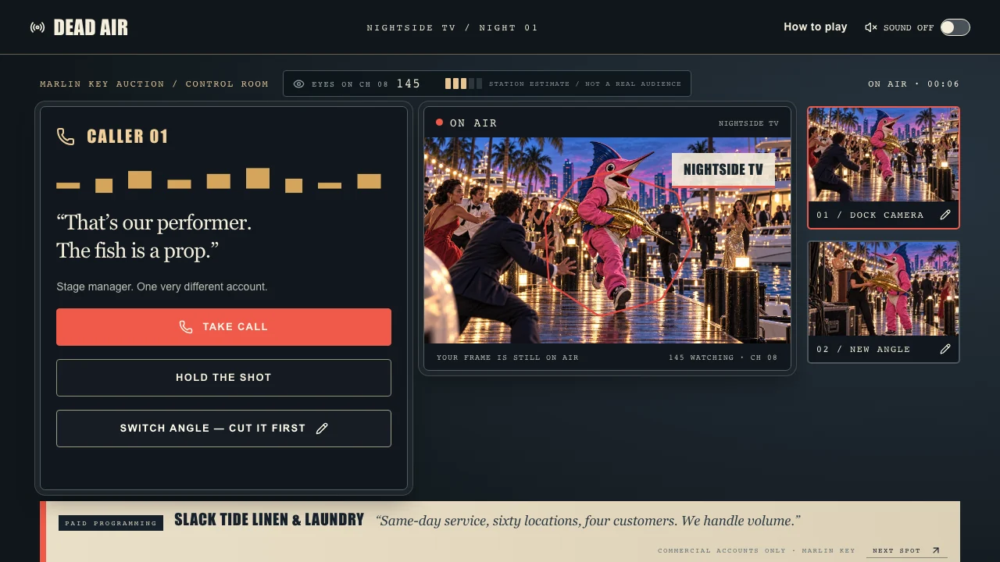 |

| The warning at the van | Your episode |
| --- | --- |
| 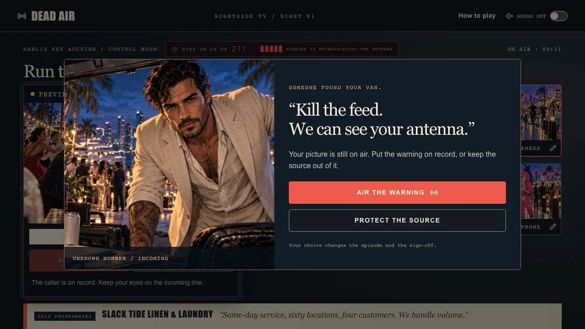 | 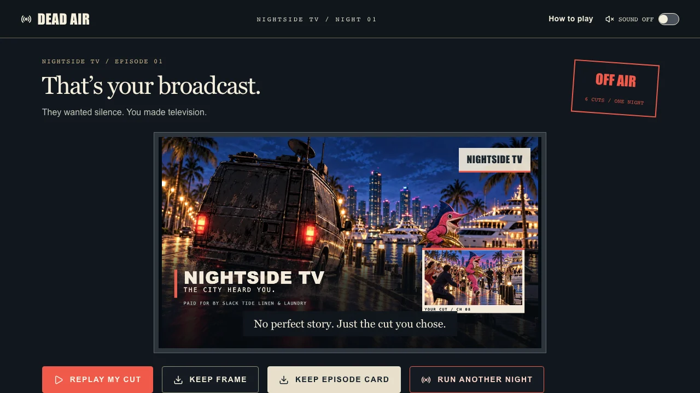 |

| Replay | Phone layout, 390 × 844 |
| --- | --- |
| 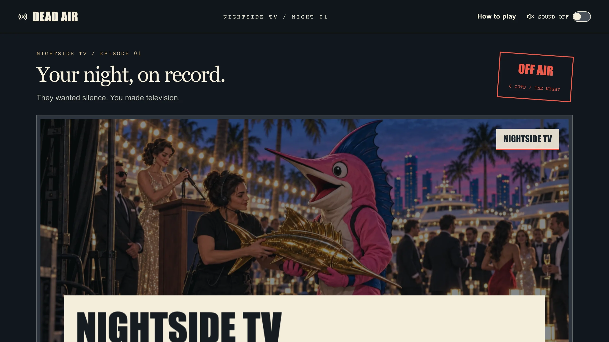 | 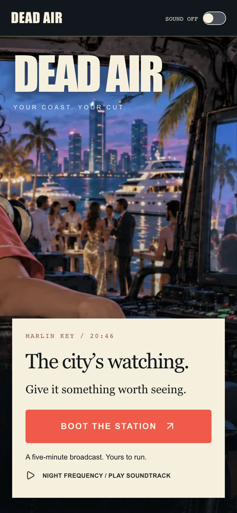 |

## Known limits

Stated plainly, because a judge will find these anyway.

- React Image Editor loads its runtime from Unlayer's CDN, so the editing step needs network access. There is a visible retry path, but "works offline" is not a claim this build earns.
- The camera feeds are animated illustrated stills, not generated video. Replay preserves the order of your cuts, not real elapsed time.
- Calls and the warning are captioned fiction. There is no recorded voice acting, no real transmission, and no audience metric.
- The session lives in the tab. **RUN ANOTHER NIGHT** restarts the night in place, but a browser refresh starts over.
- Returning to the image desk reopens your previous flattened save. Editable layer history does not survive a remount — that is the editor's documented behaviour, not a workaround.
- The soundtrack is licensed third-party music, not original composition. Attribution is in the footer and in [docs/music-license.md](docs/music-license.md).

## Current experience

- A short, skippable mobile-uplink terminal prepares the camera images before callsign entry.
- Five original coastal illustrations, with HTML controls separate from the artwork.
- Native Unlayer editing for the broadcast plate, with optional station-ident customization. An untouched Save is rejected, so the editor is a required story action rather than a decorative stop.
- Preview and on-air views hold the actual Save output.
- Take the caller, hold your image, recut it, or switch the angle — the switch loads the other camera into the editor first, so what airs is always your own cut. Then air the fixer’s warning or protect the source. These choices change the on-air image and recorded episode.
- Animated camera pans, a freeze-frame entry, hard-cut/dissolve choices, incoming notices and an accessible warning dialog. Reduced-motion settings disable auto camera cuts and animations.
- Replay the recorded image/decision sequence, recut from the interruption, or run another night from the ending — which keeps your station ident and sends you back to the cameras, so the branches are explorable without a reload.
- Download the exact edited frame or a 1600 × 1200 episode card that combines the callsign, branch outcome, closing frame, and unchanged saved editor export.
- Licensed 135 BPM “Chase Pulse” by Kevin MacLeod, CC BY 4.0, with footer attribution. Off by default, with smooth scene fades and one active music player across same-origin tabs.

This release animates illustrated stills, not generated video footage. Replay preserves sequence rather than real elapsed timing. Calls are captioned fiction, not live calls or recorded voice actors. There is no actual broadcast or simulated audience metric.

## Run

Use Node 22.13+ and `npm ci`, then `npm run dev`. No API keys or account setup. The hosted Unlayer runtime requires internet access.

| Script                 | What it does                                                                  |
| ---------------------- | ----------------------------------------------------------------------------- |
| `npm run dev`          | Vinext dev server on port 5173                                                |
| `npm run build`        | Vinext (Sites-compatible) build                                               |
| `npm run build:vercel` | Native Next.js production build — this is what deploys                        |
| `npm run lint`         | ESLint over the whole repository                                              |
| `npm run test`         | The reducer and editor-gate tests (needs Node 22.18+ for TS import stripping) |
| `npm run format`       | Prettier over all sources, using the committed `.prettierrc`                  |
| `npm run format:check` | Verify formatting without writing                                             |

`npm run test` checks exact saved-image propagation, branch differences, correction history,
recut restoration (which keeps the newest plate), per-plate captions, and the editor save gate —
including that an unverifiable editor runtime fails OPEN rather than blocking a real edit. `npm run build:vercel` type-checks as part of the build.

One ordering note: both build systems generate into `.next/types`, and the Vinext build replaces
Next's `routes.d.ts` with its own global-declaration version. A standalone `npx tsc --noEmit` is
therefore clean after `npm run build:vercel`, but reports three errors from the generated
`.next/types/validator.ts` if the Vinext build ran last. Delete `.next` or re-run
`npm run build:vercel` before type-checking by hand. Nothing in the authored sources is involved.

The app keeps the current session in memory. Refresh starts a new night. Returning to the image desk opens the previous flattened saved bitmap; editable layer history does not persist between mounts.

## Deployment

The public competition build runs at [dead-air-woad.vercel.app](https://dead-air-woad.vercel.app/). `vercel.json` selects the native Next.js production build through `npm run build:vercel`; the Vinext build remains the Sites-compatible path.

## Architecture

`app/page.tsx` owns the visible stages and native Save callback. `lib/broadcast.ts` holds deterministic state transitions and the cut history. `lib/editor-gate.ts` decides whether a Save is a genuine edit, from the tracked dirty flag and two image snapshots, and allows the save whenever the editor cannot be measured. `lib/audio.ts` plays one licensed recording with conservative scene-dependent gain. `lib/episode-card.ts` renders the downloadable episode card with Canvas while preserving the exact saved bitmap. `components/dead-air/boot-sequence.tsx` is the skippable uplink terminal that warms the camera previews.

The whole live experience is twelve authored files:

```
app/layout.tsx                          metadata, fonts, shell
app/page.tsx                            every visible stage + the Save callback
app/globals.css                         all styling: base, 3 breakpoints, reduced-motion
lib/broadcast.ts                        pure reducer: state transitions and cut history
lib/editor-gate.ts                      pure decision: is this Save a real edit?
lib/audio.ts                            single licensed player, scene-dependent gain
lib/episode-card.ts                     1600 x 1200 episode card via Canvas
lib/utils.ts                            cn() class merge
components/dead-air/boot-sequence.tsx   the uplink terminal
components/ui/                          5 shadcn primitives: button, dialog, progress,
                                        slider, switch
tests/broadcast.test.mjs                9 reducer tests
tests/editor-gate.test.mjs              11 save-gate tests
```

`app/globals.css` is ordered base rules first, then animations, then each breakpoint exactly
once (1600 px, 1000 px, 700 px), then `prefers-reduced-motion` — so the rule that applies to any
selector is findable in one place.

## Performance and image delivery

Dead Air keeps each original 1672 × 941 PNG as the untouched same-origin source passed to Unlayer
React Image Editor. Display-only surfaces use measured WebP derivatives, so the broadcast stays
light without reducing editable plate quality.

- The landing hero is the only eager, high-priority image, and it is responsive (768/1440).
- The boot sequence preloads the two 1440 px display derivatives, not the full-resolution plates,
  so nothing blocks callsign entry on multi-megabyte artwork.
- Every non-hero image uses native lazy loading and explicit `width`/`height`, so no surface
  reserves its layout late.
- The full-resolution PNG loads only when a visitor actually opens the editor on that angle.
- The two canvas composites and the episode card draw from derivatives that are still larger
  than their output boxes, so they only ever downscale.

| Surface                  |                       Before |                                            After |
| ------------------------ | ---------------------------: | -----------------------------------------------: |
| Landing hero             |              2,337,065 B PNG | 168,738 B WebP at 1440 px, or 68,412 B at 768 px |
| Boot-sequence preload    |              4,979,580 B PNG |                                   419,834 B WebP |
| Watch feed, one angle    |              2,543,141 B PNG |                                   217,854 B WebP |
| Both camera thumbnails   |              4,979,580 B PNG |                                    45,304 B WebP |
| Pressure dialog art      |              2,468,301 B PNG |                                    78,890 B WebP |
| Closing composite source |              2,718,000 B PNG |                                   245,790 B WebP |
| Soundtrack               |  4,788,279 B MP3 at 320 kbps |                      1,869,496 B MP3 at 128 kbps |
| Editable editor source   | 2,337,065 to 2,718,000 B PNG |                           Unchanged original PNG |

The landing hero drops 92.78% of its encoded weight at 1440 px and 97.07% at 768 px; the boot
preload drops 91.57%; the thumbnails drop 99.09%. All eight derivatives together are 1,026,968 B,
8.21% of the 12,502,946 B of canonical artwork, which is retained in full. Repository bytes are
shown above; actual transfer depends on viewport, cache state, and which lazy images enter the
browser's loading threshold. Measured with the Next production build served locally: the landing
transfers 168,738 B of artwork and the boot sequence a further 419,834 B.

See [display derivatives](docs/art-provenance.md#display-derivatives) for the encode commands and
the editor boundary that keeps derivatives out of the editor.

## Assets and validation boundary

See [art provenance](docs/art-provenance.md) and [music license](docs/music-license.md). No artwork from Saltline, Second Take or external entries is used. No Rockstar assets, franchise characters, trailer footage or samples. Lucide icons retain their license in [docs/LUCIDE-LICENSE.txt](docs/LUCIDE-LICENSE.txt).

Build/type/lint checks and six reducer tests are the automated validation scope. On 14 September 2026, a browser acceptance pass also covered desktop and 390 × 844 layouts, the full editor-to-broadcast path, untouched-Save rejection, branching, replay, and both PNG downloads. The downloaded episode card was inspected at its native 1600 × 1200 size. Music remains optional and off by default; listening quality is necessarily device- and listener-dependent.

On 17 September 2026 a maintenance pass reformatted the sources with Prettier, removed the unused
scaffolding, added the WebP display derivatives and the social preview card. Verified in that
pass: `npm run lint`, `npx tsc --noEmit`, `npm run build`, `npm run build:vercel` and the six
reducer tests all clean; a headless Chromium run of the Next production build confirmed the
landing and boot-sequence transfer sizes quoted above, the responsive hero picking the right
source, lazy loading and explicit dimensions on every non-hero image, and both canvas composites
producing correct 1280 x 720 output from the derivatives with no console errors. The CSS
reorganization was checked by flattening the declaration stream for all eight satisfiable
media-condition combinations and confirming an identical value sequence for every
selector-plus-property pair, so the cascade is unchanged.

On 17 September 2026 a defect pass followed: the editor save gate moved into `lib/editor-gate.ts`
and now tracks `hasChanges()` while the visitor works (it documents _unsaved_ changes, so reading
it after a save races the runtime's own reset) and compares `getImage()` snapshots, allowing the
save whenever neither signal can be measured. The caller scene can no longer be skipped by
opening a camera angle in the editor, a frame saved but not aired now airs with the sign-off, a
recut keeps the newest plate, the angle switch routes through the editor so the on-air monitor
always holds the visitor's own work, and the ending offers RUN ANOTHER NIGHT. Verified in that
pass: `npm run lint`, `npx tsc --noEmit`, `npm run build`, `npm run build:vercel` and 20 tests
clean, plus headless Chromium walks of the whole journey at 1440 px and 390 px — untouched Save
rejected, real edits accepted, no console or page errors, and no horizontal overflow.
