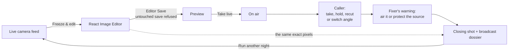

# Dead Air · Your Coast, Your Cut

An original coastal pirate-TV experience built around Unlayer React Image Editor. Name your station, catch an animated camera sequence, freeze and edit a frame, go live, handle a caller and a warning at the van, then cut your getaway episode.

[Live experience](https://dead-air-coast.vercel.app/) · [Public source](https://github.com/adityasarade/dead-air-coast)


_One continuous take of the live build: the frozen camera plate in React Image Editor, a coral ring traced round the mascot, the editor's own Save, and that exact image landing in PREVIEW / YOUR CUT and then on air — with the attention meter climbing and Marlin Key's paid programming running underneath it._

## For judges: the 60-second route

1. Select **BOOT THE STATION**. The uplink terminal runs for about a second; the coral **SKIP INTRO** button, Enter or Esc leaves it immediately.
2. Type any callsign and select **CONNECT TO CAMERA 08**.
3. On the live feed, select **FREEZE & EDIT THIS FRAME**. React Image Editor opens on the full-resolution plate. Its runtime has been downloading since step 1, so it opens straight away.
4. Make one visible move — MARK UP a line, add a HEADLINE, apply a GRADE — then use the editor's own **Save** control. An untouched Save is refused.
5. Your exact saved image is now in the **PREVIEW / YOUR CUT** monitor, the same size as the programme monitor beside it, with the preview bus lit coral. Select **TAKE LIVE** and it becomes the on-air picture.
6. Watch **EYES ON CH 08** climb. When the meter fills, the fixer has found your antenna.
7. Answer the caller, then answer the fixer's warning at the van. Select **CUT & GET OUT**, review the three-beat broadcast ledger and browsable cut strip, then **KEEP MY BROADCAST DOSSIER** to download a 1600 × 1200 record with your unmodified saved plate, choices and exact cut log inside it.
8. Select **RUN ANOTHER NIGHT** to see a different branch without redoing your ident.

The moment worth watching is step 4 into step 5: the picture you saved in Unlayer is the picture the city sees. Nothing is re-rendered, re-encoded, or substituted between the two.

Cold load to a usable editor, measured on the local production build: **2.9 s** taking the skip, **3.4 s** waiting the terminal out. Throttled to 4 Mbps with 150 ms of latency: 3.9 s and 5.6 s.

## The edit propagates — three captures from one run

| 01 The plate, untouched                                                                             | 02 Marked in React Image Editor                                                                               | 03 On air, unaltered                                                               |
| --------------------------------------------------------------------------------------------------- | ------------------------------------------------------------------------------------------------------------- | ---------------------------------------------------------------------------------- |
|  |  |  |

These are actual browser captures from the running application, not mockups. The coral stroke in 02 is the stroke in 03.

## GTA VI-inspired — what is borrowed, and what is original

**What is borrowed is a register, not an asset.** Three things, named plainly:

1. **The coastal boom town that runs on crime.** Bright, humid, moneyed, and corrupt at every level — a place where the marina, the auction and the police radio are all part of the same economy. Dead Air answers it by handing you the least glamorous job in that world: running a pirate television van from a parking spot near a waterfront auction.
2. **Satirical brands as world-building.** The genre says more about a city through its advertising than through its dialogue, so Marlin Key sells airtime. Ten original spots — a marina that takes only cash, a laundry with sixty locations and four customers, a currency exchange with nine branches and one depositor — run as lower thirds over the feed, as the PAID PROGRAMMING strip at the control desk, and as the sponsor credit on your closing frame and broadcast dossier. Every one of them is written for this project; see [`lib/sponsors.ts`](lib/sponsors.ts).
3. **The pressure of attention.** The genre's wanted level, reinterpreted for a broadcaster: **EYES ON CH 08** climbs for as long as your picture is out there, and when the meter fills, the fixer has found your antenna. It is the station's own estimate and the interface labels it as such — nothing is measured, nothing is requested, no audience is counted. It is fiction that behaves consistently, not a metric.

**Everything visible is original.** Marlin Key, NIGHTSIDE and every other callsign, the auction, the pink marlin mascot, the golden fish, the fixer, every sponsor, the captions and the sign-off lines were all written and illustrated for this project. Every business name was searched as a real trading name before it shipped, and three were rewritten because the search found live companies too close to them; `tests/station-texture.test.mjs` keeps the rejected names and every franchise term out of the list mechanically.

There are no Rockstar screenshots, no trailer footage, no franchise logos, maps, characters, place names, interface styling, audio or leaked material anywhere in this repository, and no character in Dead Air shares a name with anyone in the franchise. Dead Air is an unofficial, independent contest entry and is not affiliated with or endorsed by Rockstar Games or Take-Two Interactive. See [art provenance](docs/art-provenance.md) and [music licence](docs/music-license.md).

## The loop



Remove React Image Editor and there is no picture to broadcast: Preview, the on-air monitor, the correction history, the replay and the broadcast dossier all render the one `dataUrl` the editor returned.

## Screenshots

| Arrival                                                                                            | Station uplink                                                                  |
| -------------------------------------------------------------------------------------------------- | ------------------------------------------------------------------------------- |
|  |  |

| Your callsign                                                            | The live feed                                                                                    |
| ------------------------------------------------------------------------ | ------------------------------------------------------------------------------------------------ |
|  |  |

| The control room                                                                                                                                                                               | The caller                                                                                          |
| ---------------------------------------------------------------------------------------------------------------------------------------------------------------------------------------------- | --------------------------------------------------------------------------------------------------- |
|  |  |

| The warning at the van                                                   | Your episode                                                                                     |
| ------------------------------------------------------------------------ | ------------------------------------------------------------------------------------------------ |
|  |  |

| Replay                                                                                     | Phone layout, 390 × 844                                             |
| ------------------------------------------------------------------------------------------ | ------------------------------------------------------------------- |
|  |  |

## Known limits

Stated plainly, because a judge will find these anyway.

- React Image Editor loads its runtime from Unlayer's CDN, so the editing step needs network access. There is a visible retry path, but "works offline" is not a claim this build earns.
- The camera feeds are animated illustrated stills, not generated video. Replay preserves the order of your cuts, not real elapsed time.
- Calls and the warning are captioned fiction. There is no recorded voice acting and no real transmission.
- **EYES ON CH 08 is invented.** It is a number the fictional station makes up about itself: it climbs on a timer while you are on air, it drives when the fixer's warning arrives, and it carries a fraction of itself into a second night. No request is made, nothing is measured, and no one is counted. The meter is labelled _STATION ESTIMATE / NOT A REAL AUDIENCE_ on screen for exactly this reason.
- The paid programming is satire about a fictional town. None of the ten businesses exists, and none is based on a real company.
- The session lives in the tab. **RUN ANOTHER NIGHT** restarts the night in place, but a browser refresh starts over.
- Returning to the image desk reopens your previous flattened save. Editable layer history does not survive a remount — that is the editor's documented behaviour, not a workaround.
- The soundtrack is licensed third-party music, not original composition. Attribution is in the footer and in [docs/music-license.md](docs/music-license.md).

## Current experience

- A one-second, skippable mobile-uplink terminal prepares the camera images before callsign entry, with a coral SKIP INTRO button plus Enter and Esc. Unlayer's editor runtime starts downloading the moment you commit to the night, so the editor opens on arrival rather than on request.
- Five original coastal illustrations, with HTML controls separate from the artwork.
- Native Unlayer editing for the broadcast plate, with optional station-ident customization. An untouched Save is rejected, so the editor is a required story action rather than a decorative stop.
- Preview and on-air are two identical 16:9 monitors side by side, a broadcast gallery: PREVIEW / YOUR CUT holds the actual Save output, the preview bus lights coral while it holds something unaired, and TAKE LIVE moves it across. The camera rack is a third column beside them rather than a row underneath.
- EYES ON CH 08 — a five-segment attention meter that climbs while you are on air and summons the fixer when it fills. Declared fiction on screen.
- Marlin Key's paid programming: ten original satirical spots, running as a bug over the live feed, as the PAID PROGRAMMING strip at the desk, and as the sponsor credit on the closing frame and the broadcast dossier.
- Take the caller, hold your image, recut it, or switch the angle — the switch loads the other camera into the editor first, so what airs is always your own cut. Then air the fixer’s warning or protect the source. These choices change the on-air image and recorded episode.
- Animated camera pans, a freeze-frame entry, hard-cut/dissolve choices, incoming notices and an accessible warning dialog. Reduced-motion settings disable auto camera cuts and animations.
- Replay the recorded image/decision sequence from a direct-manipulation cut strip, read the picture/line/warning outcome ledger, recut from the interruption, or run another night from the ending — which keeps your station ident and sends you back to the cameras, so the branches are explorable without a reload.
- Download the exact edited frame or a 1600 × 1200 broadcast dossier that combines the callsign, night number, all three branch outcomes, exact recorded frames, sponsor credit, and unchanged saved editor export.
- Every composite the app draws itself — the station ident, the closing shot and the broadcast dossier — uses shrink-to-fit display type on a stack that degrades predictably, so a long callsign is never squashed and no platform silently substitutes a different face.
- Licensed 135 BPM “Chase Pulse” by Kevin MacLeod, CC BY 4.0, with footer attribution. Off by default, with smooth scene fades and one active music player across same-origin tabs.

This release animates illustrated stills, not generated video footage. Replay preserves sequence rather than real elapsed timing. Calls are captioned fiction, not live calls or recorded voice actors. There is no actual broadcast, and the on-screen attention estimate is declared fiction rather than a measurement.

## Run

Use Node 22.13+ and `npm ci`, then `npm run dev`. No API keys or account setup. The hosted Unlayer runtime requires internet access.

| Script                 | What it does                                                                  |
| ---------------------- | ----------------------------------------------------------------------------- |
| `npm run dev`          | Vinext dev server on port 5173                                                |
| `npm run build`        | Vinext (Sites-compatible) build                                               |
| `npm run build:vercel` | Native Next.js production build — this is what deploys                        |
| `npm run lint`         | ESLint over the whole repository                                              |
| `npm run test`         | Reducer, editor-gate and station-texture tests (Node 22.18+ for TS stripping) |
| `npm run format`       | Prettier over all sources, using the committed `.prettierrc`                  |
| `npm run format:check` | Verify formatting without writing                                             |

`npm run test` runs 32 tests. They check exact saved-image propagation, branch differences,
correction history, recut restoration (which keeps the newest plate), per-plate captions, the three-beat episode ledger, the
attention estimate (it must only ever climb, must always reach the threshold that summons the
fixer, must never read full before it does, and must never open a second night already hot), the
paid-programming list (complete, unique, in the station's voice, and clear of every franchise term
and known trade name), the shrink-to-fit canvas type, and the editor save gate — including that an
unverifiable editor runtime fails OPEN rather than blocking a real edit. `npm run build:vercel`
type-checks as part of the build.

One ordering note: both build systems generate into `.next/types`, and the Vinext build replaces
Next's `routes.d.ts` with its own global-declaration version. A standalone `npx tsc --noEmit` is
therefore clean after `npm run build:vercel`, but reports three errors from the generated
`.next/types/validator.ts` if the Vinext build ran last. Delete `.next` or re-run
`npm run build:vercel` before type-checking by hand. Nothing in the authored sources is involved.

The app keeps the current session in memory. Refresh starts a new night. Returning to the image desk opens the previous flattened saved bitmap; editable layer history does not persist between mounts.

## Deployment

The public competition build runs at [dead-air-coast.vercel.app](https://dead-air-coast.vercel.app/), which is the canonical URL. `vercel.json` selects the native Next.js production build through `npm run build:vercel`; the Vinext build remains the Sites-compatible path. The project's earlier generated hostname still resolves to the same deployment, so older links keep working.

## Architecture

`app/page.tsx` owns the visible stages and native Save callback. `lib/broadcast.ts` holds deterministic state transitions, the cut history, the three-beat outcome ledger and the attention estimate. `lib/editor-gate.ts` decides whether a Save is a genuine edit, from the tracked dirty flag and two image snapshots, and allows the save whenever the editor cannot be measured. `lib/editor-warmup.ts` pre-injects Unlayer's documented embed script so the editing step is not the first thing to touch the network. `lib/sponsors.ts` is Marlin Key's paid programming. `lib/canvas-type.ts` supplies the display and mono stacks plus the shrink-to-fit measurement used by all three canvas composites. `lib/audio.ts` plays one licensed recording with conservative scene-dependent gain. `lib/episode-card.ts` renders the downloadable broadcast dossier with Canvas while preserving the exact saved bitmap. `components/dead-air/boot-sequence.tsx` is the skippable uplink terminal that warms the camera previews.

The whole live experience is fifteen authored files:

```
app/layout.tsx                          metadata, CDN preconnect, shell
app/page.tsx                            every visible stage + the Save callback
app/globals.css                         all styling: base, 3 breakpoints, reduced-motion
lib/broadcast.ts                        pure reducer: transitions, cut history, attention
lib/editor-gate.ts                      pure decision: is this Save a real edit?
lib/editor-warmup.ts                    warms Unlayer's hosted runtime, and the first plate
lib/sponsors.ts                         ten original Marlin Key ad spots
lib/canvas-type.ts                      canvas font stacks + shrink-to-fit measurement
lib/audio.ts                            single licensed player, scene-dependent gain
lib/episode-card.ts                     1600 x 1200 broadcast dossier via Canvas
lib/utils.ts                            cn() class merge
components/dead-air/boot-sequence.tsx   the uplink terminal
components/ui/                          5 shadcn primitives: button, dialog, progress,
                                        slider, switch
tests/broadcast.test.mjs                13 reducer and attention tests
tests/editor-gate.test.mjs              11 save-gate tests
tests/station-texture.test.mjs          7 sponsor-hygiene and canvas-type tests
```

`app/globals.css` is ordered base rules first, then animations, then each breakpoint exactly
once (1600 px, 1000 px, 700 px), then `prefers-reduced-motion` — so the rule that applies to any
selector is findable in one place.

## Performance and image delivery

Dead Air keeps each original 1672 × 941 PNG as the untouched same-origin source passed to Unlayer
React Image Editor. Display-only surfaces use measured WebP derivatives, so the broadcast stays
light without reducing editable plate quality.

- The landing hero is the only eager, high-priority image, and it is responsive (768/1440).
- The boot sequence preloads the two 1440 px display derivatives, not the full-resolution plates,
  so nothing blocks callsign entry on multi-megabyte artwork.
- Every non-hero image uses native lazy loading and explicit `width`/`height`, so no surface
  reserves its layout late.
- The editor runtime is warmed from Unlayer's CDN as soon as the visitor selects BOOT THE STATION,
  behind a `preconnect`, so the slowest request in the journey overlaps the two screens they have
  to pass through anyway. The default angle's full-resolution PNG follows at `fetchPriority="low"`,
  strictly after the runtime, so it never competes with it. The other angle's PNG still loads only
  when the visitor opens that angle.
- The two canvas composites and the broadcast dossier draw from derivatives that are still larger
  than their output boxes, so they only ever downscale.

| Surface                  |                       Before |                                            After |
| ------------------------ | ---------------------------: | -----------------------------------------------: |
| Landing hero             |              2,337,065 B PNG | 168,738 B WebP at 1440 px, or 68,412 B at 768 px |
| Boot-sequence preload    |              4,979,580 B PNG |                                   419,834 B WebP |
| Watch feed, one angle    |              2,543,141 B PNG |                                   217,854 B WebP |
| Both camera thumbnails   |              4,979,580 B PNG |                                    45,304 B WebP |
| Pressure dialog art      |              2,468,301 B PNG |                                    78,890 B WebP |
| Closing composite source |              2,718,000 B PNG |                                   245,790 B WebP |
| Soundtrack               |  4,788,279 B MP3 at 320 kbps |                      1,869,496 B MP3 at 128 kbps |
| Editable editor source   | 2,337,065 to 2,718,000 B PNG |                           Unchanged original PNG |

The landing hero drops 92.78% of its encoded weight at 1440 px and 97.07% at 768 px; the boot
preload drops 91.57%; the thumbnails drop 99.09%. All eight derivatives together are 1,026,968 B,
8.21% of the 12,502,946 B of canonical artwork, which is retained in full. Repository bytes are
shown above; actual transfer depends on viewport, cache state, and which lazy images enter the
browser's loading threshold. Measured with the Next production build served locally: the landing
transfers 168,738 B of artwork — one file, the responsive hero — and the boot window a further
2,962,975 B over three files.

That boot figure is deliberately larger than it used to be, and the trade is worth naming. Two of
the three files are the camera-preview derivatives the terminal has always warmed (419,834 B). The
third is `dock.png`, 2,543,141 B: the canonical full-resolution plate the editor will be handed if
the visitor edits the first angle, which it almost always is. It is requested at
`fetchPriority="low"`, strictly after Unlayer's runtime has finished loading, so it never competes
with anything the visitor is waiting on — and it is not extra traffic, only earlier traffic, since
opening the editor on that angle would fetch exactly the same bytes. Throttled to 4 Mbps, moving it
here made callsign entry _faster_ (5.6 s → 4.7 s) rather than slower, because the CDN round trip it
now sits behind used to happen after the visitor asked for the editor. The second angle's plate is
still fetched only if the visitor opens that angle.

See [display derivatives](docs/art-provenance.md#display-derivatives) for the encode commands and
the editor boundary that keeps derivatives out of the editor.

## Assets and validation boundary

See [art provenance](docs/art-provenance.md) and [music license](docs/music-license.md). No artwork from Saltline, Second Take or external entries is used. No Rockstar assets, franchise characters, trailer footage or samples. Lucide icons retain their license in [docs/LUCIDE-LICENSE.txt](docs/LUCIDE-LICENSE.txt).

Build/type/lint checks and 32 unit tests are the automated validation scope. On 14 September 2026, a browser acceptance pass also covered desktop and 390 × 844 layouts, the full editor-to-broadcast path, untouched-Save rejection, branching, replay, and both PNG downloads. The downloadable broadcast record is 1600 × 1200. Music remains optional and off by default; listening quality is necessarily device- and listener-dependent.

On 17 September 2026 a maintenance pass reformatted the sources with Prettier, removed the unused
scaffolding, added the WebP display derivatives and the social preview card. Verified in that
pass: `npm run lint`, `npx tsc --noEmit`, `npm run build`, `npm run build:vercel` and the six
reducer tests all clean; a headless Chromium run of the Next production build confirmed the
landing and boot-sequence transfer sizes quoted above, the responsive hero picking the right
source, lazy loading and explicit dimensions on every non-hero image, and both canvas composites
producing correct 1280 x 720 output from the derivatives with no console errors. The CSS
reorganization was checked by flattening the declaration stream for all eight satisfiable
media-condition combinations and confirming an identical value sequence for every
selector-plus-property pair, so the cascade is unchanged.

On 17 September 2026 an interface and world-building pass followed the defect pass below.

- **Time to the editor.** Unlayer's hosted runtime is now warmed behind a `preconnect` from the
  moment the visitor selects BOOT THE STATION, the uplink terminal runs at 240 ms a line instead
  of 550 ms and holds 320 ms instead of 800 ms on completion, and its exit is a coral primary
  button plus Enter and Esc rather than a quiet link. Cold load to a usable editor went from
  3.1 s to **2.9 s** taking the skip and from 5.5 s to **3.4 s** waiting the terminal out; at
  4 Mbps with 150 ms of latency, from 4.8 s to **3.9 s** and from 7.8 s to **5.6 s**.
- **The control desk.** Preview and programme are now two identical 16:9 monitors with the camera
  rack as a third column. The visitor's own saved plate previously sat letterboxed in a 30 %-wide
  4:3 box next to a full-size monitor showing the auto-composed ident; the preview bus now also
  lights coral whenever it holds something unaired, so TAKE LIVE needs no explanation. The channel
  bug no longer prints the callsign on top of the ident that already carries it.
- **The canvas composites.** The station ident, the closing shot and the broadcast dossier were all
  drawn in `Impact` — a font absent on Linux and Android, where they silently fell back — with
  long callsigns horizontally squashed by `fillText`'s `maxWidth`. They now share
  `lib/canvas-type.ts`: a predictable heavy-sans stack, shrink-to-fit measurement, registration
  marks and scanlines. The ident is a composed slate rather than one cream slab, and the episode
  card prints the right night number instead of always "EPISODE 01".
- **Phone.** No horizontal overflow at any stage at 390 × 844, verified per stage. The image desk
  takes the full width of the handset, Preview comes before programme so the visitor's own cut is
  the first thing on screen, the closing frame is capped so the sign-off actions stay above the
  fold, and the editor step carries advisory copy about turning the handset and about the
  editor's own controls collapsing to icons at that width.
- **States.** The editor's runtime and image failures now each get a recovery card inside the
  frame that failed, with a direct retry, instead of a dismissible notice whose only cure was a
  footer link that asked for confirmation. The boot watchdog distinguishes "it failed" from "it is
  slow". A measured advisory appears if the editor's own canvas collapses (see below).
- **World.** Ten original satirical ad spots, and the EYES ON CH 08 attention meter that summons
  the fixer. Both are covered in the GTA VI section above and in Known limits.

**One defect found and mitigated rather than fixed:** at 390 px the hosted editor lays its tool
panel out at a fixed width beside the tool rail, and the two together are wider than the frame, so
opening MARK UP leaves its canvas about 30 px wide. That layout belongs to the editor runtime and
cannot be restyled from outside it. Dead Air reclaims every pixel of the handset's width for the
frame, measures the canvas box while the desk is open, and when it collapses shows a pinned notice
explaining that turning the phone sideways restores a full canvas — verified: 318 px portrait with
the panel closed, 30 px portrait with it open, 431 px landscape with it open.

On 17 September 2026 a defect pass came first: the editor save gate moved into `lib/editor-gate.ts`
and now tracks `hasChanges()` while the visitor works (it documents _unsaved_ changes, so reading
it after a save races the runtime's own reset) and compares `getImage()` snapshots, allowing the
save whenever neither signal can be measured. The caller scene can no longer be skipped by
opening a camera angle in the editor, a frame saved but not aired now airs with the sign-off, a
recut keeps the newest plate, the angle switch routes through the editor so the on-air monitor
always holds the visitor's own work, and the ending offers RUN ANOTHER NIGHT. Verified in that
pass: `npm run lint`, `npx tsc --noEmit`, `npm run build`, `npm run build:vercel` and 20 tests
clean, plus headless Chromium walks of the whole journey at 1440 px and 390 px — untouched Save
rejected, real edits accepted, no console or page errors, and no horizontal overflow.
